# Image parsing
Back in 2019, I was trying to get into software development by making automated software [automated software](https://github.com/k1dnap/poe-bot). In 2022, when I got some free time, I attempted to ressurect that project and make some improvements

## Purpose and idea
The original idea of this project was about implementing automated software for playing videogame Dota2 with using some deep learning techniques.
In fact, the project was abandoned on a stage of parsing the data from screen. It mostly was a pet project on to place hands on deep learning.

I've found a research papers of OpenAI team making similar projects (Dota2, Starcraft 2), and decided to repeat their projects. Looks not that complicated:
- get data
- proceed
- make actions
But they can retrieve the data from the game client by using client's backend, while in regular cases, it's impossible(excluding reverse engineering). Since I'm not skillful enough in reverse engineering, I decided to extract the data from the picture. 

Since there are minimum 7 classes of bars, and bars may be in different state(relying on current hp and maximum hp)

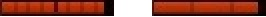

openCV approach didnt look that promising, because it needs to be tuned, and some game changes may change the contrast\brightness of the bars, and openCV approach needs to be tuned again, object detection using deep learning method was chosen.

## preparations
In OpenAI Starcraft 2 project, I've found a picture, which nearly describes the data they were using in this project

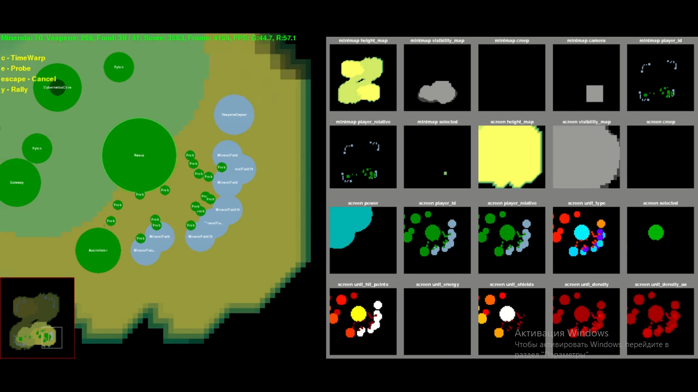

I've decided to make the same for Dota 2, in theory it supposed to look like

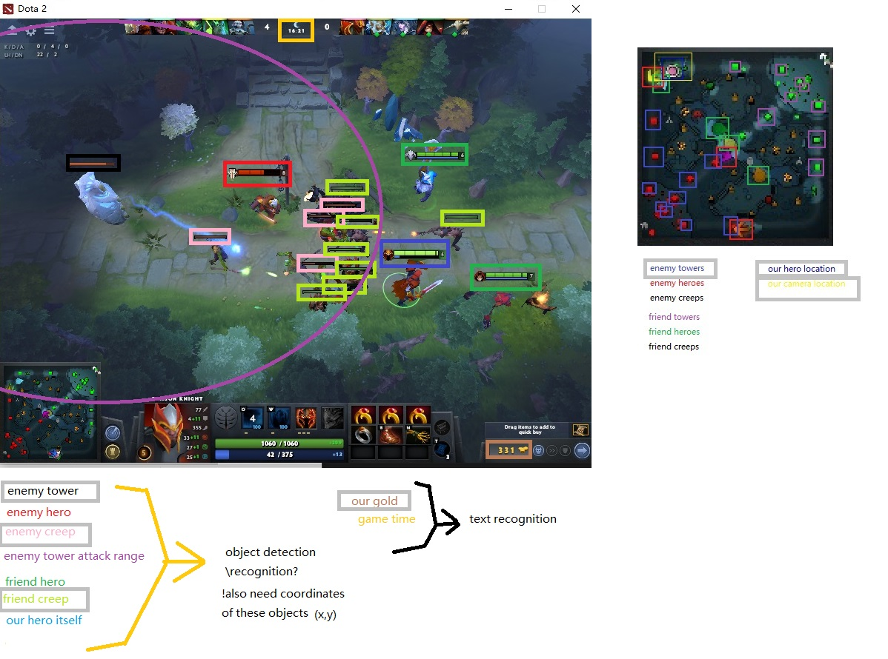

The data about game objects(most likely their position) could be retrieved from minimap, also from the screen itself. I've decided to detect the bars first. 

## yolo v3-v5(not quite sure)
The model was trained on samples for day or two in google colab, I wasn't quite satisfied with the results, because the bars itself were pretty small. 

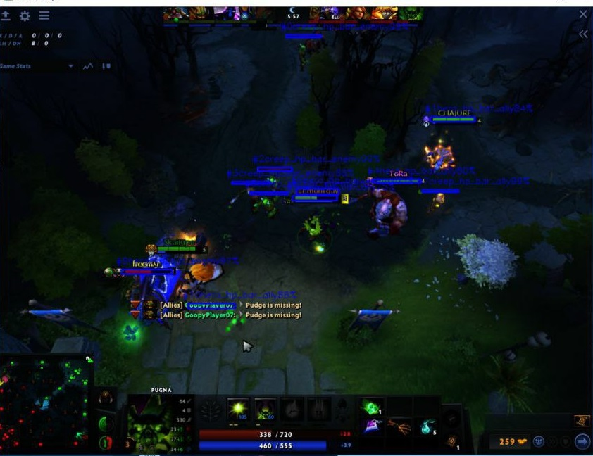

And sometimes bars could overlap each other where yolo type models couldnt detect 2 small objects nearby

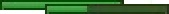

## v0
[v0 notebook](0_Circle_Detection_and_Localization.ipynb)
I've decided to make a custom object detection model. Since we dont need to detect cats\dogs of different types, it looks more than possible to create this model, if the data is presented
This is the original ipynb I've found for basic segmentation from scratch without using any backbones or other object detection frameworks. It was a base for this project.

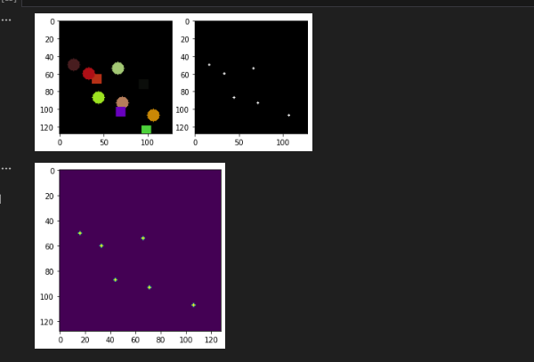

## v1
[v1 notebook](screen_detection_v1.ipynb)
test samples:
original, labels, output

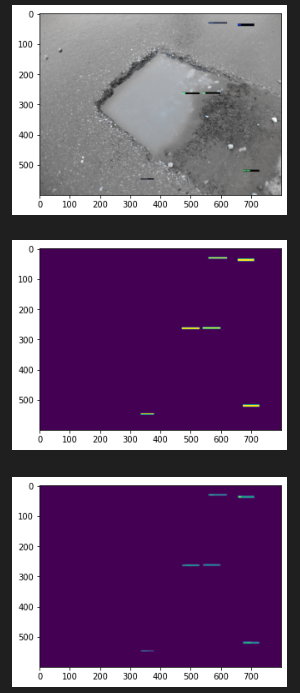

real sample:

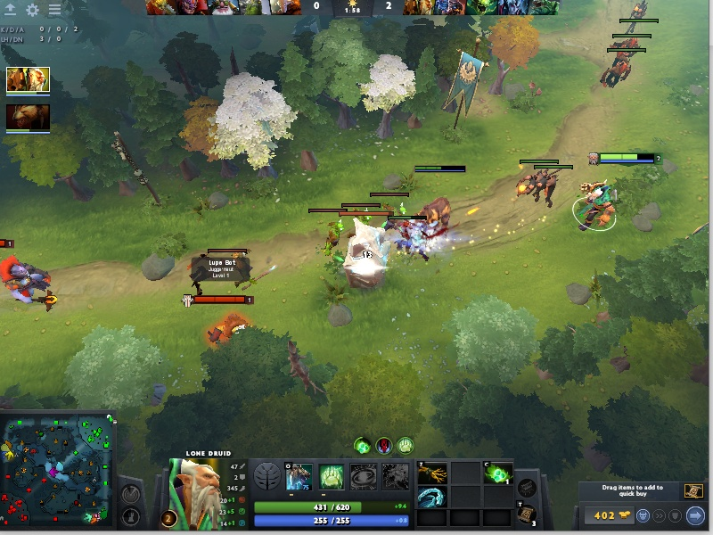

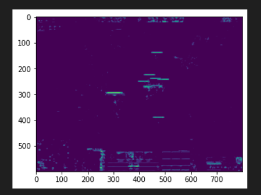

## v2
[v2 notebook](screen_detection_v2.ipynb)
real sample:

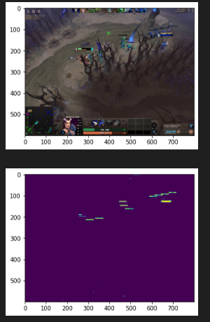

results may good satisfying, but these results were achieved after 4-5 epochs of training, if the model was trained for ~20+ epochs, the results started to be worse. 

## v3
[v3 notebook](screen_detection_v3.ipynb)
real sample:
original, segmentated, centers

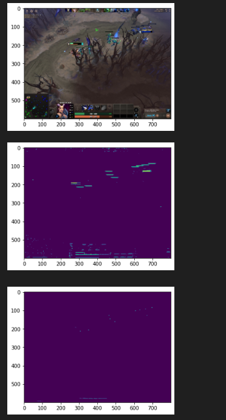

Here I've tried to reimplement [CenterNet](https://github.com/xingyizhou/CenterNet), but with 2 outputs:
- segmented
- centers
The results were looking satisfying, even after 20+ epochs of training.

I started to look how to detect the coordinates of objects by using deep learning, rather than opencv.findContours, but couldnt find anything. And the project was abandoned, since I had a primary job, which wasnt related to computer vision and deep learning.

### Problems\cases during development
- the main problem I've faced, was inaccuracy after 20+ epochs of training on real examples. I think that the problem was in .jpg compression. Training samples originally were in bgra, then saved to .jpg. Then, training data was generated relying on those compressed .jpg samples. And the models were trained on these samples. At the same time, my training samples were in .jpg format as well. Which made it look like training on compressed samples, and verifying on compressed samples as well.
- lack of mentorship\information. Nowdays chatgpt may provide adequate suggestions\advices on next steps.